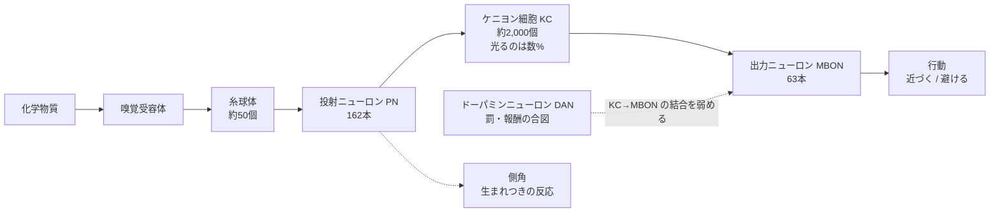

# fly-connectome

ショウジョウバエの脳の**配線図**を使って、においを覚える回路がどう組まれているのかを確かめるプロジェクト。

2026年9月、オスのショウジョウバエの中枢神経系（脳と腹側神経索）について、
すべてのニューロンとシナプスを電子顕微鏡で追跡した配線図 **MaleCNS v1.0** が公開された（HHMI Janelia / Google）。
このリポジトリはそこから、学習と記憶を担う**キノコ体**の部分だけを取り出し、
「この配線は、でたらめに繋いだ配線と比べて何が違うのか」を測る。

**サイト: https://masachika-kamada.github.io/fly-connectome/** （インストール不要、ブラウザで開くだけ）

- **遊ぶ** — 「ハエのおつかい」。商品の匂いを1回覚えさせたハエが、店の中からそれを探して持ってくる。
  「脳の中を見る」では、覚えさせた匂いでキノコ体の中の何が変わるかを見られる（[説明](docs/DEMO.md)）
- **読む** — 予備知識なしで見られる解説アニメーション（3分20秒）
- **詳しく** — 実験の結果・図・限界は [docs/RESULTS.md](docs/RESULTS.md)、データの出どころは [docs/DATA.md](docs/DATA.md)

---

## 背景

### 配線図（コネクトーム）とは

脳を数万枚の薄い層に分けて電子顕微鏡で撮影し、1個1個の細胞の形を追いかけ、
**どの細胞がどの細胞に、何個のシナプスで繋がっているか**を数え上げたもの。

データとしては巨大な**有向グラフ**になる。ノードがニューロン、辺が「AからBへのシナプスの数」。
行列で書けば、行も列もニューロンで、ほとんどのマスがゼロの表。
このプロジェクトが使うのはその一部で、たとえば「投射ニューロン162本 × ケニヨン細胞2,045個」の行列
（(i, j) のマスに、i から j へのシナプスの数が入っている）。

配線図で分かることと、分からないことがある。

| 分かる | 分からない |
|---|---|
| 誰が誰に繋がっているか | 1個のシナプスがどれだけ強く効くか |
| 何個のシナプスで繋がっているか | 細胞がいつ、どう発火するか |
| 細胞の形と種類 | 学習によってどう変わったか |

配線図は回路図であって、動作の記録ではない。
なので、配線図から何かを言うには「こう動くはず」というモデルを1つ置いて、その上で計算することになる。
このプロジェクトもそうしている（[置いている仮定](#置いている仮定)）。

### キノコ体 — においを覚える回路

ハエは、においを罰（電気ショックなど）や報酬（砂糖など）と結びつけて覚え、次からそのにおいを避けたり、近づいたりする。
その学習が起きる場所がキノコ体で、回路は驚くほど素直な多段構成になっている。



数字はこのプロジェクトで使う右半球のキノコ体の実測値。

| 段 | 何をしているか |
|---|---|
| **嗅覚受容体** | 化学物質に反応するセンサー。種類ごとに、よく反応する物質が違う |
| **糸球体** | 同じ受容体を持つ細胞が集まる場所。ここでにおいは「約50個の糸球体がそれぞれどれだけ反応したか」という数字の並びになる |
| **投射ニューロン（PN）** | 糸球体の信号をキノコ体へ運ぶ。同じ信号は側角にも届き、そちらは生まれつきの反応（カビの臭いを避ける、など）を担う |
| **ケニヨン細胞（KC）** | 各KCは約6本のPNから入力を受ける。抑制性の細胞（APL）が全体を抑えるので、1つのにおいで光るのはごく一部 |
| **出力ニューロン（MBON）** | KCの出力を読んで、「近づけ」「避けろ」という形で行動に影響する。キノコ体は約15の**区画**に分かれていて、区画ごとに別のMBONがいる |
| **ドーパミンニューロン（DAN）** | 罰や報酬があると、特定の区画に合図を送る。そのとき光っていたKCとMBONの間のシナプスが**弱くなる**。これが記憶 |

### 抽象的に見ると

入力と出力で言えば、キノコ体は次のような計算をしている。

1. **入力**: においの指紋。約50個の糸球体の反応の強さを並べた、約50次元のベクトル
2. **変換**: それを約2,000次元に広げ、強く反応した上位数%だけを残して、0と1の並び（コード）にする。
   似たにおいは、光る細胞の組み合わせも似る
3. **出力**: 区画ごとに、MBONが受け取る入力の合計。罰と結びついたにおいでは、その区画への入力が小さくなり、ハエは避ける

計算機科学の言葉で言うと、2は「ランダムに次元を広げて上位だけ残す」**局所性鋭敏型ハッシュ（LSH）**で
（Dasgupta, Stevens & Navlakha, Science 2017）、3は**ハッシュを鍵にした連想記憶**。
機械学習で言えば、1層目は学習しない固定の射影で、学習するのは最後の読み出しだけ、という2層のネットワークにあたる。

学習は結合を「強める」ことはなく「弱める」だけなので、書き込み続けると余地がなくなる。
何件まで覚えられるかは、区画が何個のKCを読んでいるかで決まる。

### 用語

| 用語 | 意味 |
|---|---|
| 次数 | 1個の細胞が何本の相手と繋がっているか。「PN側の次数」は、1本のPNが何個のKCに届くか |
| スパース（疎） | ほとんどがゼロ、ごく一部だけが1。KCのコードは約2,000個中の約100個だけが1 |
| 区画 | キノコ体を分ける単位。ドーパミンもMBONも区画ごとに違い、罰の区画と報酬の区画がある |
| LTD | 長期抑圧。シナプスが弱くなる形の学習。キノコ体の記憶はこれで書かれる |
| 対照（ランダム化） | 実測の配線から一部の性質だけを残して、残りをでたらめにした比較用の配線 |

---

## このプロジェクトの問い

キノコ体の「PN から KC への繋がり方はランダム」というのは、これまで**仮定**だった。
上のLSHの理論も、この仮定の上に立っている。実測の配線図が手に入ったので、確かめられるようになった。

1. 実物の配線は、ランダムな配線より良いハッシュになっているか
2. 1つの区画に、何件の記憶を書き込めるか

### 方法 — 性質を1つずつ壊して比べる

実測の配線から、ある性質だけを残して他を壊した「偽物の配線」を作り、同じ計算をして成績を比べる。
たとえば「各細胞が何本繋がっているか（次数）は保ったまま、相手だけを全部入れ替える」。
これで成績が変わらなければ、壊した部分、つまり**誰と誰が繋がっているか**には情報がなかったと言える。

においは2種類で試す。統計を揃えた**合成のにおい**と、
受容体ごとの反応を実測したデータベース DoOR 2.0 にある**実在の化学物質67種**。

### 分かったこと

- **一本一本の配線に情報はない。** 相手を一本残らず入れ替えても、成績は変わらない。実在のにおいで測っても、
  実物の配線は入れ替えた配線20本の分布のちょうど真ん中にいる。「ランダムな繋がり」という仮定は実測で支持された
- **ただし、入力ごとの結合数は偏っている。** 何個のKCに届くかが入力によって大きく違い、
  特に温度と湿度の入力はほとんど読まれていない。その分、汎用の「似たものを探す」性能は一様ランダムな配線より約4割低い
- **覚えられる数は区画の大きさで決まる。** 大きい区画で20件前後。区画によって10倍違う
- **似たにおいも避けるようになる。** 罰したにおいと受容体の反応パターンが似ているほど強く避ける（r = 0.82）。
  結果として、同じ化学クラスの物質がまとめて避けられる（偶然の3.9倍）
- **行動まで通すと、実物の配線が効いてくる。** 1回嗅がせた商品を店から取ってこさせる「おつかい」では、
  実物の配線で正答74%（でたらめなら7%）。取り違えるのは、バナナと日本酒のように香りの成分がかぶる組だけ。
  張り替えた脳（次数保存 66%、一様ランダム 58%）には、38個すべてに勝った。
  「似たものを似たまま保つ」成績では実物は張り替えと同じか下だったので、見分ける課題では向きが逆になる

数字・図・限界の詳細は [docs/RESULTS.md](docs/RESULTS.md)。

### 置いている仮定

配線図には強さも動きも入っていないので、次のモデルを置いている。

- シナプスの**数**を、結合の**強さ**の代わりに使う
- KCの発火は「入力の合計を取り、上位5%だけが光る」で近似する
- 学習は「そのとき光っていたKCから、その区画のMBONへの結合を85%弱める」だけ。忘却や強化はない
- 右半球のキノコ体だけを見る

---

## 使う

```bash
uv sync                                # .venv を作り、flymb を editable で入れる

uv run scripts/fetch_connectome.py     # neuPrint からキノコ体の部分グラフ（認証不要）
uv run scripts/fetch_odors.py          # DoOR 2.0 の匂い応答テーブル
uv run scripts/build_odor_map.py       # 両者を突き合わせる
uv run scripts/build_errand.py         # おつかいの店の品ぞろえ
uv run scripts/build_pages.py          # ページを生成し、公開用の site/ を組み立てる

node web/serve.js                      # http://localhost:5173
```

| ページ | 中身 |
|---|---|
| [`/`](http://localhost:5173/)（トップ） | ハエのおつかい。1回嗅がせた商品を、店の中から探して持ってこさせる |
| [`brain.html`](http://localhost:5173/brain.html) | 脳の中を見る。実在の化学物質67種を覚えさせて、キノコ体の中を見る |
| [`explainer.html`](http://localhost:5173/explainer.html) | 解説アニメーション。3分20秒・8章 |
| [`figures.html`](http://localhost:5173/figures.html) | 実験結果の図6枚 |

各ページの中身は [docs/DEMO.md](docs/DEMO.md)。

公開サイトは、`main` に push するたびに GitHub Actions（`.github/workflows/pages.yml`）が
`site/` を組み立て直し、テストを通してから GitHub Pages に載せる。

実験を走らせ直す場合（結果は `results/*.json` と `figures/*.svg`、乱数シードは固定）:

```bash
uv run experiments/exp1_hash.py
uv run experiments/exp2_capacity.py
uv run experiments/exp3_compartments.py
uv run experiments/exp4_real_odors.py  # DoOR が必要
node experiments/exp5_errand.js        # おつかい。ページと同じ JavaScript で動く
uv run scripts/make_figures.py
```

テスト:

```bash
uv run pytest                          # 乱数対照が主張どおりの構造を保つか、など
node --test "web/*.test.js"           # 配信サーバー、共通ナビ、おつかいのシミュレーション
```

`fetch_connectome.py` と `fetch_odors.py` はキャッシュがあればネットワークに出ない（`--force` で再取得）。

## 構成

```
flymb/              共有ライブラリ。scripts/ と experiments/ はここを呼ぶだけ
  paths.py            作業中のチェックアウトを pyproject.toml から探して基準にする
  data.py             キャッシュした部分グラフの読み込み（非嗅覚KCの除外もここ）
  odors.py            糸球体チャンネルの対応、合成匂いの生成、糸球体の役割（文献）
  door.py             DoOR 2.0 の実在の匂いを、この回路の入力に変換する
  wiring.py           ランダム化の対照（degree_swap / pn・kc_degree_kept / uniform / …）
  coding.py           スパース符号化、LTD、AUC、mAP
  capacity.py         1区画の学習と採点、デモで選べる区画

scripts/            データ取得とビルド。並び順が実行順
experiments/        5本の実験。1〜4は flymb/、5は web/errand-core.js（ページと共用）にだけ依存
tests/              flymb の性質テスト（pytest）
web/                手書きのページ、共通ナビ、おつかいのシミュレーション、開発サーバー
docs/               RESULTS.md（結果・限界）、DEMO.md（サイト）、DATA.md（データの出どころ）
data/ results/ figures/   生成物。コミットしてある
dist/ site/         生成ページと、公開用に組み立てたサイト。.gitignore
.github/workflows/  サイトを GitHub Pages に載せるワークフロー
```

`flymb/paths.py` は作業ディレクトリから上に辿って `pyproject.toml` を探すので、
**チェックアウト内ならどこからでも実行できる**。クローンを複数持っていても、それぞれが自分の `data/` を使う。
`FLYMB_ROOT` で明示的に上書きもできる。

## データとライセンス

公開データのみ。MaleCNS v1.0 は CC BY 4.0、DoOR 2.0（DoOR.data）は CC BY-SA 4.0。
DoOR から作ったデータ（`data/odor_kc.json`、`data/errand.json` の匂いの部分）は、同じ CC BY-SA 4.0 で配布する。
取得方法と突き合わせの詳細は [docs/DATA.md](docs/DATA.md)。

コードは MIT（[LICENSE](LICENSE)）。
